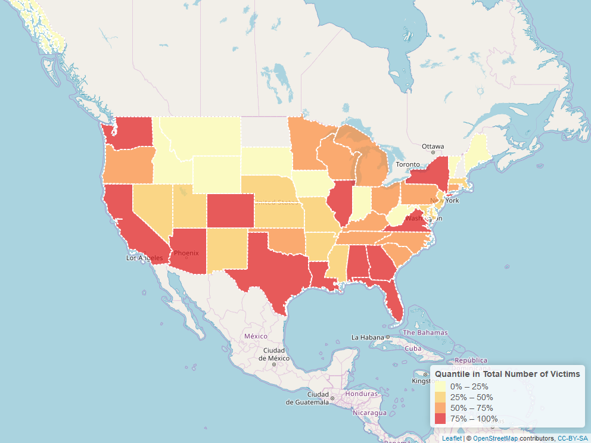

```{r, echo=FALSE,warning=FALSE, message=FALSE}
library(tm)
library(tidyr)
library(tidytext)
library(dplyr)
library(rgdal)
library(plotly)
library(ggplot2)
library(benford.analysis)
library(leaflet)
library(wordcloud2)
```

# 1 Data Information

## 1.1 Introduction

The definition of mass shooting used for this database is 3 or more shooting victims (not necessarily fatalities), not including the shooter. The shooting must not be identifiably gang, drug, or organized crime related. The souce of the Stanford Mass Shootings of America (MSA) data is https://library.stanford.edu/projects/mass-shootings-america. The data was collected in a project began in 2012, in reaction to the mass shooting in Sandy Hook, CT. In their initial attempts to map this phenomena it was determined that no comprehensive collection of these incidents existed online. The Stanford Geospatial Center set out to create a single point repository for as many mass shooting events as could be collected via online media. The result was the Stanford MSA. The data can be downloaded from https://github.com/StanfordGeospatialCenter/MSA.

```{r}
MSD_S <- read.csv("Stanford_MSA_Database.csv")
```

## 1.2 Data Cleaning

```{r}
# Generate a new column: Total.Number.of.Injured
MSD_S$Total.Number.of.Injured <- MSD_S$Number.of.Civilian.Injured +
  MSD_S$Number.of.Enforcement.Injured

# Select interesting variables into new dataset: MSD
MSD <- MSD_S %>%
  dplyr::select(Title, Location, City, State, Latitude, Longitude, 
         Total.Number.of.Injured, Total.Number.of.Fatalities,
         Total.Number.of.Victims, Date, Day.of.Week,
         Number.of.shooters, Average.Shooter.Age, Shooter.Sex, Shooter.Race, 
         Type.of.Gun...General, Total.Number.of.Guns, 
         Fate.of.Shooter.at.the.scene, Fate.of.Shooter, Shooter.s.Cause.of.Death,
         School.Related, Place.Type, Targeted.Victim.s...General, 
         History.of.Mental.Illness...General, Military.Experience)

# Split date into Year and Month
MSD$Year <- format(as.Date(MSD$Date, format="%m/%d/%Y"),"%Y")
MSD$Month <- format(as.Date(MSD$Date, format="%m/%d/%Y"),"%m")

# Transfer catergories of School.Related
MSD$School.Related[MSD$School.Related=="Killed"]<- "Unknown"
MSD$School.Related[MSD$School.Related=="no"]<- "No"

# Combine categories of shooter.Race
MSD$Shooter.Race[MSD$Shooter.Race=="Asian American/Some other race"]<- "Asian American"
MSD$Shooter.Race[MSD$Shooter.Race=="Black American or African American/Unknown"]<- 
  "Black American or African American"
MSD$Shooter.Race[MSD$Shooter.Race=="Some other race"]<- "Some Other Race"
MSD$Shooter.Race[MSD$Shooter.Race=="White American or European American/Some other Race"]<- 
  "White American or European American"

# Check NA
sapply(MSD, function(x) sum(is.na(x)))
  
# Structure of the data
str(MSD)

```

# 2 Data Validity Analysis

In this part, we can juestify whether total number of victims in each mass shooting accident follow the benford distribution to find out the potential fraud published data.

## 2.1 Total number of injured

```{r}
bfd.injured <- benford(MSD$Total.Number.of.Injured)
bfd.injured
plot(bfd.injured)
```

The result of chi-squared test shows p-value is smaller than 0.05. Therefore, we should reject the null hypothesis, which means it is probable that there may exist some fake data in the total number of injured. Also, from the plots, we can also find out the total number of injured does not follow benford law very well. But we should notice real data will never conform perfectly to Benford's Law.

## 2.2 Total Number of Victims

```{r}
bfd.victims <- benford(MSD$Total.Number.of.Victims)
bfd.victims
plot(bfd.victims)
```

The result of chi-squared test shows p-value is smaller than 0.05. Therefore, we should reject the null hypothesis, which means it is probable that there may exist some fake data in the total number of victims. Also, from the plots, we can also find out the total number of victims does not follow benford law very well. But we should notice real data will never conform perfectly to Benford's Law.

# 2.3 Distribution Plot

```{r, warning=FALSE}
ggplot(MSD, aes(x=Total.Number.of.Victims)) + 
    geom_histogram(aes(y=..density..),binwidth=100,
                   colour="white", fill="tomato") +
    geom_density(alpha=.2, fill="tomato")+
    labs(title="Figire 2.1", 
         subtitle="Density Distribution of Total Number of Victims",
         x="Total Number of Victims")+
    xlim(c(0,100))
```

From the plot, we can see large total number of victims happens less frequent than small total number of victims. The distribution is obviously right-skewed.

# 3 Exploratory Data Analysis

## 3.1 Density Distribution of Total Number of Victims by Gender

```{r}
g <- ggplot(MSD, aes(Total.Number.of.Victims))
g + geom_density(aes(fill=factor(Shooter.Sex)), alpha=0.8) + 
    labs(title="Figure 3.1", 
         subtitle="Density Distribution of Total Number of Victims by Gender",
         x="Total Number of Victims",
         fill="Gender")
```

We can see distributions of total number of victims for different genders are largely different from each other.


## 3.2 Pie Chart of Shooter Race

```{r}
MSD_r <- MSD %>%
  select(Shooter.Race) %>%
  group_by(Shooter.Race) %>%
  summarise(count=n())

race_pie <- plot_ly(MSD_r, labels = ~Shooter.Race, values = ~count, type = 'pie',
                     textposition = 'inside',textinfo = 'percent') %>%
  layout(title="Figure 3.2 Pie Chart of Shooter Race")

ggplotly(race_pie)
```

We can see from the pie chart that most of shooters are "White American or European American".And only 0.896% of shooters are "Native American or Alaska Native".

## 3.3 Mass Shootings in US by Year and Month

```{r plotly, warning=FALSE, message=FALSE}
plot_ly(data = MSD
        ,type = 'scatter'
        ,mode = 'markers' 
        ,hoverinfo = 'text'
        ,x = ~Month
        ,y = ~Year
        ,size = ~Total.Number.of.Victims
        ,color = ~Shooter.Sex
        ,colors = c('Red', 'Blue', 'Green', 'Black')
        ,alpha = 0.6
        ,text = ~paste("Title: ", Title
               ,"\nLocation: ", Location
               ,'\n Date: ', Date 
               ,'\n Total victims : ', Total.Number.of.Victims)) %>% 
  layout(title = "Figure 3.3 Mass Shootings in US by Year and Month"
         , xaxis = list(title = "Month")
         , yaxis = list(title = "Years"))
```

The circle size represents the number of victims in the mass shooting and the color means the gender of shooters. We can find out that most of shooters are males and the worst mass shooting happened randomly.

## 3.4 Total victims by Years and School Related

```{r,warning=FALSE, message=FALSE}
# year + race
MSD_ys <- MSD %>%
  select(Year, School.Related, Total.Number.of.Victims) %>%
  group_by(Year, School.Related) %>%
  summarise(sum=sum(Total.Number.of.Victims))

plot_ly(data = MSD_ys
        ,type = 'bar'
        ,mode = 'markers'
        ,x = ~Year
        ,y = ~sum
        ,color = ~School.Related
        ,alpha = 0.9) %>% 
  layout(title = "Figure 3.4 Total victims by Years and School Related"
         , xaxis = list(title = "Year")
         , yaxis = list(title = "Number of Total Victims")
         , showlegend = T
         , barmode = 'stack'
         , position = 1
         , xaxis = list(title = "")
         , yaxis = list(title = "")
         , legend = list(x = 0, y = 1)
         , hovermode = 'compare')
```

We can see the total number of victims in 2016 is the largest and there is an increasing trend over years. Besides, the large percentage of school related mass shooting cannot be ignored.

## 3.5 Bar Chart of Place Type

```{r}
MSD_place <- MSD %>%
  select(Place.Type, Total.Number.of.Victims) %>%
  group_by(Place.Type) %>%
  summarise(count=n()) %>%
  arrange(desc(count))

g <- ggplot(MSD_place, aes(Place.Type, count))
g + geom_bar(stat="identity", width = 0.5, fill="tomato2") + 
      labs(title="Figure 3.5", 
           subtitle="Pie Chart of Place Type",
           xlab="Place Type") +
      theme(axis.text.x = element_text(angle=65, vjust=0.6))
```

We can see the frequency of mass shootings happened in residual home is the largest, then the frequency of street/highway is the second largest.


## 3.6 Map for Total Number of Victims in Each State

```{r map_victims, message=FALSE, warning=FALSE}
MSD_state <- MSD %>%
  select(State, Total.Number.of.Injured, Total.Number.of.Victims) %>%
  group_by(State) %>%
  mutate(Sum.Injured=sum(Total.Number.of.Injured)) %>%
  mutate(Sum.Victims=sum(Total.Number.of.Victims)) %>%
  select(State, Sum.Injured, Sum.Victims) %>%
  unique()

## Download data from Natural Earth
url <- "http://www.naturalearthdata.com/http//www.naturalearthdata.com/download/50m/cultural/ne_50m_admin_1_states_provinces.zip"
tmp <- tempdir()
file <- basename(url)
download.file(url, file)
unzip(file, exdir = tmp)
## Read the data into R
state_spatial <- readOGR(dsn=tmp,
                         layer = "ne_50m_admin_1_states_provinces", 
                         encoding = "UTF-8")
#get the states name in spatial data
a<-state_spatial@data[["gn_name"]] #because the state name in "states" are in lower format
# state_spatial@data[["gn_name"]]<-a
data<-sp::merge(state_spatial,MSD_state,by.x="gn_name",by.y="State",sort=FALSE,duplicateGeoms = TRUE,all.x=FALSE)
labels <- sprintf(
  "<strong>%s</strong><br/>%s Total number of injured<br/>%g Total number of victims",
  data$gn_name, data$Sum.Injured, data$Sum.Victims
) %>% lapply(htmltools::HTML)


# leaflet
m <- leaflet(data) %>%
  addTiles()%>%
  setView(-96, 37.8, 4)
#bins
pal <- colorQuantile("YlOrRd", domain = MSD_state$Sum.Victims)
#pal(states$Donations)
m_victims <- m %>% addPolygons(
  fillColor = ~pal(data$Sum.Victims),
  weight = 2,
  opacity = 1,
  color = "white",
  dashArray = "3",
  fillOpacity = 0.7,
  highlight = highlightOptions(
    weight = 5,
    color = "#666",
    dashArray = "",
    fillOpacity = 0.7,
    bringToFront = TRUE),
  label = labels,
  labelOptions = labelOptions(
    style = list("font-weight" = "normal", padding = "3px 8px"),
    textsize = "15px",
    direction = "auto")
) %>%
  addLegend(pal = pal, values = ~Sum.Victims, opacity = 0.7, title = "Quantile in Total Number of Victims",
            position = "bottomright")
m_victims
# mapview::mapshot(m_victims, file = "mapstate.png")
# 
```

## 3.7 Map for Mass Shooting Distribution

```{r,message=FALSE,warning=FALSE}
g <- list(
    scope = 'usa'
  , projection = list(type = 'albers usa')
  , showland = TRUE
  , landcolor = 'black'
  , subunitwidth = 1
  , countrywidth = 1
 , subunitcolor = toRGB("white")
 , countrycolor = toRGB("white")
)

plot_geo(MSD
         #, locationmode = 'USA-states'
         , sizes = c(10, 300)) %>%
  add_markers(
    x = ~Longitude
    , y = ~Latitude
    , size = ~Total.Number.of.Victims
    , color = ~Total.Number.of.Fatalities
    , colors = colorRamp(c("yellow", "red", "black"))
    , hoverinfo = "text"
    , text = ~paste(MSD$Title
                    , '\n Fatalities: ', MSD$Total.Number.of.Fatalities
                    , '\n Injured: ', MSD$Total.Number.of.Injured)
  ) %>%
  layout(title = 'Geography of Mass Shooting in US', geo = g)

```

We can see that most mass shooting happened along the east coastline.

# 4 Text Mining

```{r,message=FALSE, warning=FALSE}
# Remove numbers
text <- data.frame(text=removeNumbers(as.character(MSD_S$Description)))
text$text <- as.character(text$text)

# Sort frequency
text_n <-text %>% 
  unnest_tokens(output=word, input=text) %>%
  anti_join(stop_words) %>%
  count(word, sort = TRUE)
      
# Wordcloud   
wordcloud2(text_n,color="random-light",rotateRatio = 0.3)
```

We can see the most eight frequent words are “killed”, “shooting”, “school”, “killing”, “shot”, “home”, “students” and ”suicide”.


# 5 Modeling

```{r, warning=FALSE, message=FALSE}
r1 <- lm(log(Total.Number.of.Victims)~Shooter.Sex+Shooter.Race+School.Related+
           as.numeric(Average.Shooter.Age)+poly(as.numeric(Total.Number.of.Guns),degree=2), data=MSD)
summary(r1)

plot(r1, which=1)
car::marginalModelPlots(r1)
```

From the summary result, the p value of F statistics is small and some coefficients are significant. Besides, from the residual plot, we can see that although some points have a little decreasing trend, they relatively randomly dispersed around the horizontal line at zero (the dashed black line). And after looking at the last marginal plot, we can conclude the polynomial model can fit the data well.

So the linear model is:

$log(Total.Number.of.Victims)=2.286846-0.233329\times Male-0.645376\times Male/Female+0.014205\times SexUnknown-0.293947\times Black American or African American-0.089957\times Native American or Alaska Native-0.196481\times Some Other Race -0.040855\times Two or more races-0.460007\times RaceUnknown-0.112876\times White American or European American+0.014221\times SchoolRelatedUnknown-0.088223SchoolRelatedYes-0.001907\times Shooter.Age+0.108433\times guns-5.462212\times guns^2$


